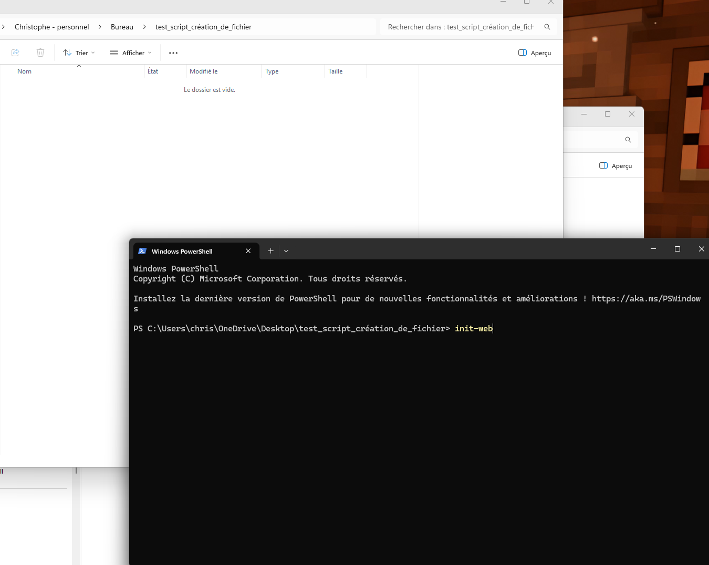
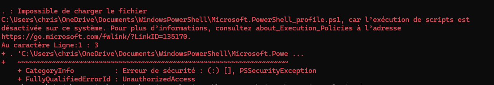

# Création de dossier html, css, js -- window automatique 🚀

- Un script d'automatisation PowerShell conçu pour initialiser instantanément un environnement de travail de développement web standard.

## 📋 Description

- Permet d'automatiser la création de fichier avec une seule commande, vous pouvez inscrire ce que vous vouler dans les fichiers et les modifier a votre guise.

### les éléments que le script génére:

- Un fichier "index.html" avec une structure HTML5 de base.
- Un fichier "stylesheet.css" incluant un reset du margin padding et border box
- Un fichier "javascript.js" vide et lié.
- Une structure de dossiers assets/image, son, video

## 🛠️ Installation

1. **Téléchargement** : Enregistrez le fichier "init.ps1" sur votre ordinateur et copier son chemin d'emplacement. Par exemple, pour moi c'est: "D:/init.sh/init.ps1".
2. **Autorisation** : Pour permettre l'exécution de scripts locaux sur Windows, ouvrez PowerShell en tant qu'administrateur et tapez :

   ```powershell
   Set-ExecutionPolicy RemoteSigned -Force
   ```

3. **Lancer Le script n'importe où** : Configuration de l'Alias (Optionnel) : Pour lancer le script n'importe où avec la commande init-web ( ou n'importe quelle commande que vous voulez), ajoutez ceci à votre profil PowerShell

   ```PowerShell :
   code $PROFILE
   ```

- Pour trouver le ficher dans votre explorateur de fichier

  ```PowerShell :
  explorer (Split-Path $PROFILE)
  ```

4. Ensuite, cela vas vous ouvrir un dosier sur vs code et vous n'aver qu'a entrer cette commande et sauvegarder (ctrl + s) et fermer la page.

   ```function init-web {
   PowerShell -ExecutionPolicy Bypass -File "D:\init.sh\init.ps1"
   }
   ```

   ```function nom_de_la_fonction{
   PowerShell -ExecutionPolicy Bypass -Lien/vers/le/fichier/init.ps1
   }
   ```

- Maintenant vous pouvez écrire Le nom de la fonction "init-web" dans le terminal de votre nouveau dossier et tout devrai fonctioner comme par magie!



# ⚠️ Important en cas de message d'erreur.

- si vous aver ce message d'erreur dans votre window powershell apres avoir écris la fonction et enregistré le ficher
  
- si c'est le cas alors vous devez ouvrir un powershell et permettre l'exécution de la fonction alors ouvrer un power en temps qu'adminitrateur et copier coller ceci:

  ```powershell
   Set-ExecutionPolicy RemoteSigned -Force
  ```

- par la suite relancer vs code ou votre dossier et tout devrai marcher.

---

### Fait par Christophe Granger et Gemini

# English :

# HTML, CSS, JS and folder creation -- for Windows 🚀

A PowerShell automation script designed to instantly initialize a standard web development workspace.

## 📋 Description

This script automates the creation of your project files with a single command. You can customize the default content of the generated files to suit your needs.

### Elements generated by the script:

- An **index.html** file with a basic HTML5 structure.
- A **stylesheet.css** file including a global reset (margin, padding, and border-box).
- An empty and linked **javascript.js** file.
- An **assets** folder structure: `assets/image`, `assets/son` (sound), and `assets/video`.

## 🛠️ Installation

1.  **Download**: Save the `init.ps1` file to your computer and copy its file path.
    _Example path:_ `D:/init.sh/init.ps1`

2.  **Authorization**: To allow the execution of local scripts on Windows, open PowerShell as an **Administrator** and run:

    ```powershell
    Set-ExecutionPolicy RemoteSigned -Force
    ```

3.  **Run the script anywhere on your computer** : Alias Configuration (Optional): To run the script anywhere using the init-web command (or any command you want), add this to your PowerShell profile:

    ```PowerShell :
    code $PROFILE
    ```

- To find the file in your file explorer:

  ```PowerShell :
  explorer (Split-Path $PROFILE)
  ```

- Next, this will open a file in VS Code and you just have to enter this command, save (Ctrl + S), and close the page:

  ```
  function init-web {
   -ExecutionPolicy Bypass -File "link/of/the/file/ps1"
  }
  ```

  ```function name_of_the_function {
  PowerShell -ExecutionPolicy Bypass -Path/to/the/file/init.ps1
  }
  ```

- Now you can type the function name "init-web" into the terminal of your new folder and everything should work like magic!

# ⚠️ Important in case of an error message.

- If you get this error message in your Windows PowerShell after writing the function and saving the file:
  

- If this is the case, then you must open PowerShell and allow the function to execute. Open PowerShell as an administrator and copy/paste this:

  ```powershell
  Set-ExecutionPolicy RemoteSigned -Force
  ```

- Afterward, restart VS Code or your folder and everything should work.

### Made by Christophe Granger and Gemini
